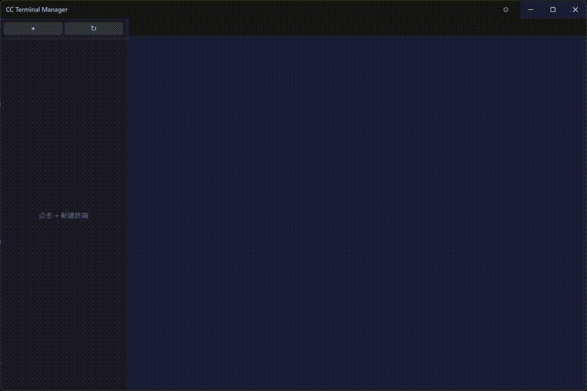
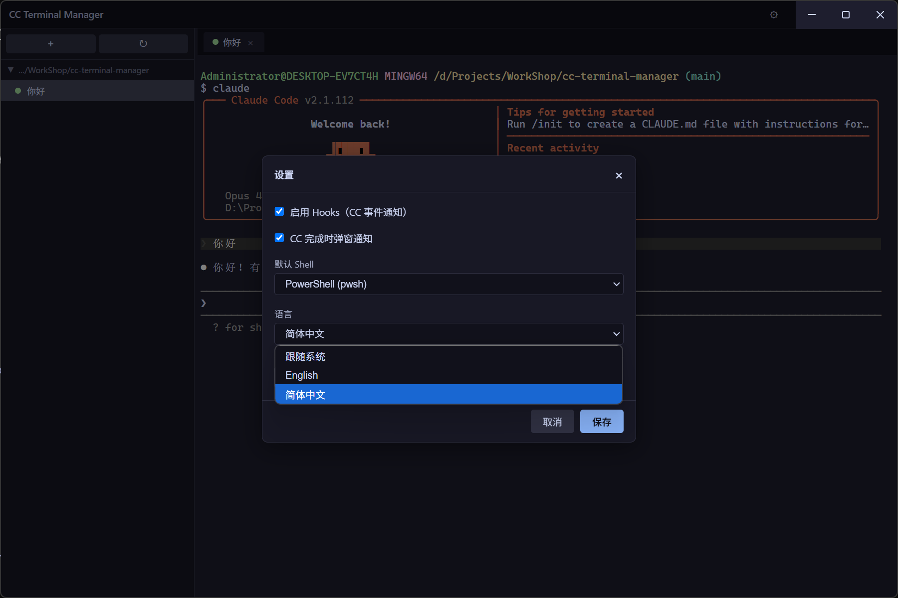
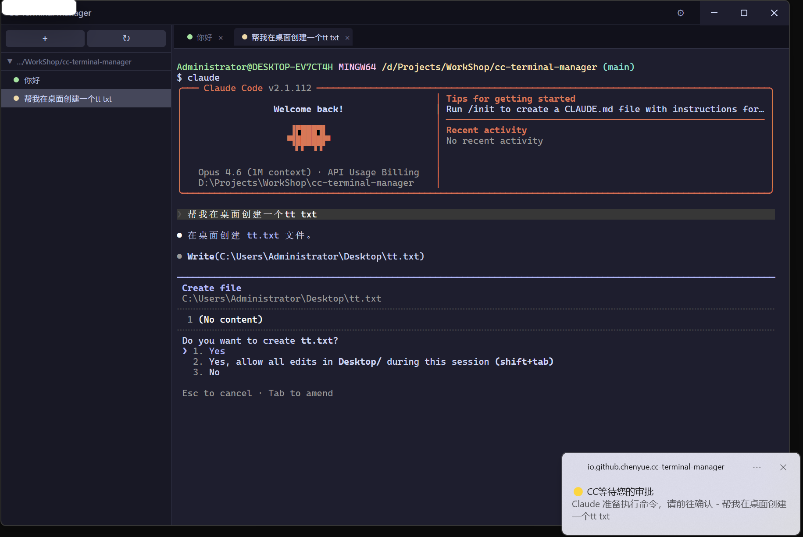
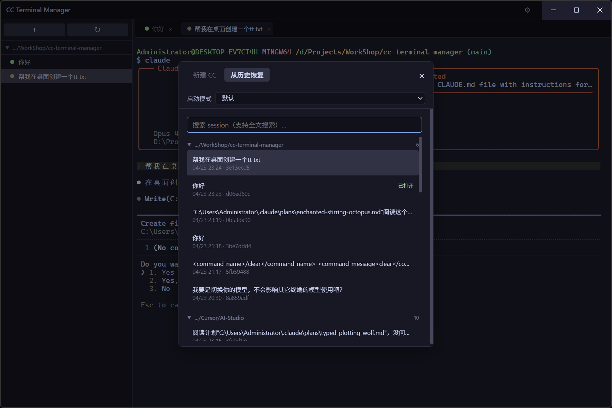

# CC Terminal Manager

A tabbed terminal manager for [Claude Code](https://docs.anthropic.com/en/docs/claude-code) sessions on Windows.



## Features

- **Tabbed terminals** — Run multiple Claude Code sessions side by side
- **Session status detection** — Real-time status indicators (thinking, waiting for approval, idle)
- **Desktop notifications** — Get notified when Claude finishes or needs your approval
- **Session history** — Browse and resume previous Claude Code sessions with full-text search
- **Multiple launch modes** — Default, YOLO (skip permissions), Plan mode
- **Tray icon** — Badge shows pending sessions count
- **Auto-naming** — Sessions are automatically named from your first message

| Settings | Notifications | Resume Session |
|----------|--------------|----------------|
|  |  |  |

## Platform Support

- ✅ Windows 10/11 x64 (tested)
- ❌ Windows ARM64 (not tested, PRs welcome)
- ❌ macOS / Linux (not supported yet)

## Installation

### Prerequisites

- [Claude Code CLI](https://docs.anthropic.com/en/docs/claude-code) installed and working

### Download

Download the latest release from the [Releases page](https://github.com/qq2499899011/cc-terminal-manager/releases):

- **`CC.Terminal.Manager-Setup-x.y.z.exe`** — NSIS installer (recommended)
- **`CC.Terminal.Manager-x.y.z-win-x64.zip`** — Portable version (no install needed)

### Windows SmartScreen Warning

> ⚠️ This app is **not yet code-signed**. When you run the installer, Windows Defender SmartScreen will show **"Windows protected your PC"**. This is expected behavior for unsigned apps.
>
> To proceed:
> 1. Click **"More info"**
> 2. Click **"Run anyway"**
>
> You can verify the authenticity of the installer by checking the SHA256 checksum published on the [Release page](https://github.com/qq2499899011/cc-terminal-manager/releases).

## How It Works

### Hooks Mechanism

CC Terminal Manager integrates with Claude Code through its [hooks system](https://docs.anthropic.com/en/docs/claude-code/hooks):

1. When you enable hooks in Settings, the app modifies `~/.claude/settings.json` to register `Stop` and `Notification` hooks
2. A local HTTP server runs on `127.0.0.1:7800` to receive hook events
3. The bundled `cc-hook.exe` is called by Claude Code on events, forwarding them to the local server
4. All injected entries are tagged with `__cc_manager__` marker for clean removal

**Before modifying `settings.json`**, the app creates a timestamped backup in `%APPDATA%/cc-terminal-manager/backups/`.

### Uninstalling

1. Open Settings in the app and **disable hooks** first
2. Then uninstall via Windows Settings > Apps, or run the uninstaller
3. The NSIS uninstaller will also clean up any remaining hook entries from `~/.claude/settings.json`

## Development

```bash
git clone https://github.com/qq2499899011/cc-terminal-manager.git
cd cc-terminal-manager
npm install
npm run rebuild   # rebuild node-pty for Electron
npm run dev       # build renderer + launch in dev mode
```

See [CONTRIBUTING.md](CONTRIBUTING.md) for more details.

## FAQ

**Q: The app says Claude Code CLI is not found?**
A: Make sure `claude` is available in your PATH. Run `claude --version` in a terminal to verify.

**Q: Hooks are enabled but I don't get notifications?**
A: Check that `~/.claude/settings.json` contains entries with `__cc_manager__` marker. Try disabling and re-enabling hooks in Settings.

**Q: Terminal shows nothing after creating a session?**
A: The app launches `claude` in a PTY. If Claude Code is not installed or the shell is misconfigured, the terminal may appear blank. Check the default shell setting.

## License

[MIT](LICENSE) © 2026 chenyue

---

[简体中文](README.zh-CN.md)
